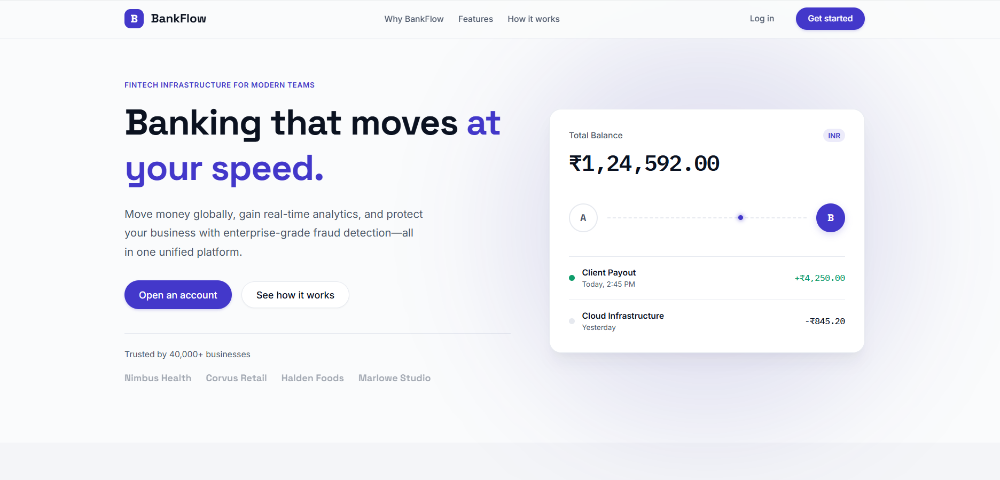
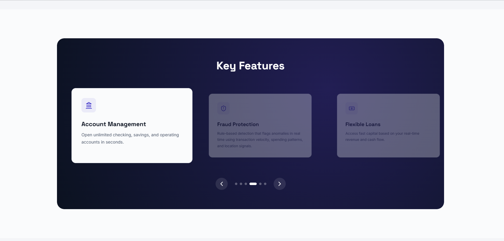
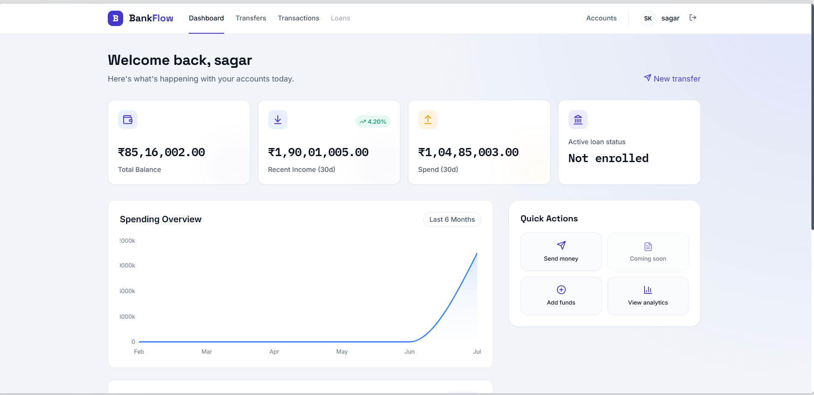
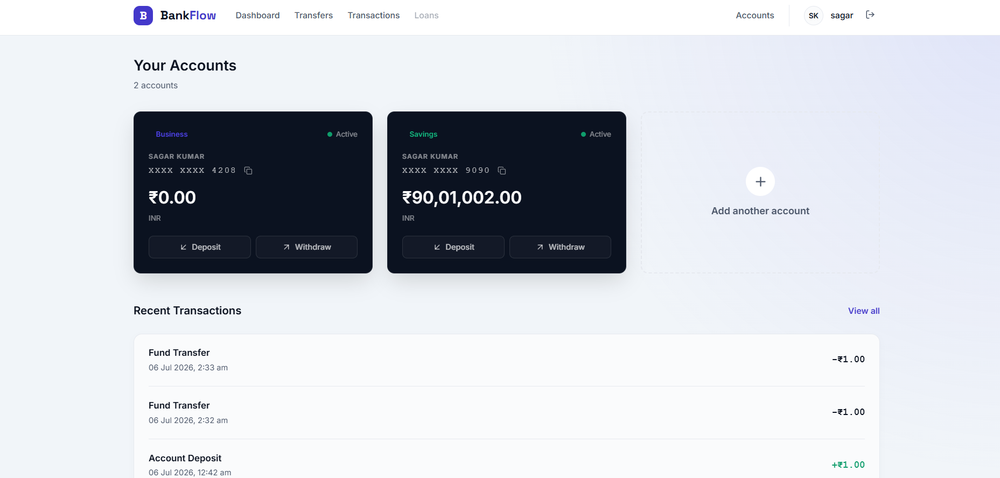
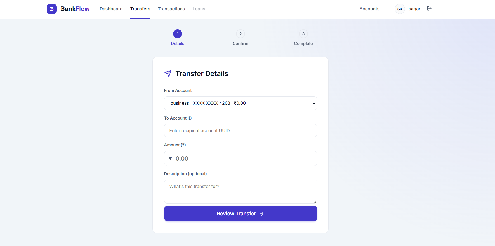
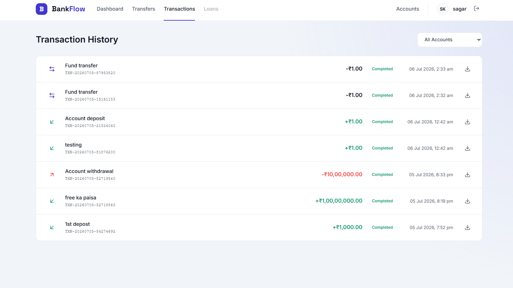
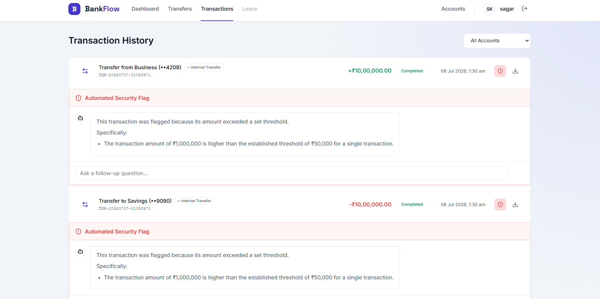
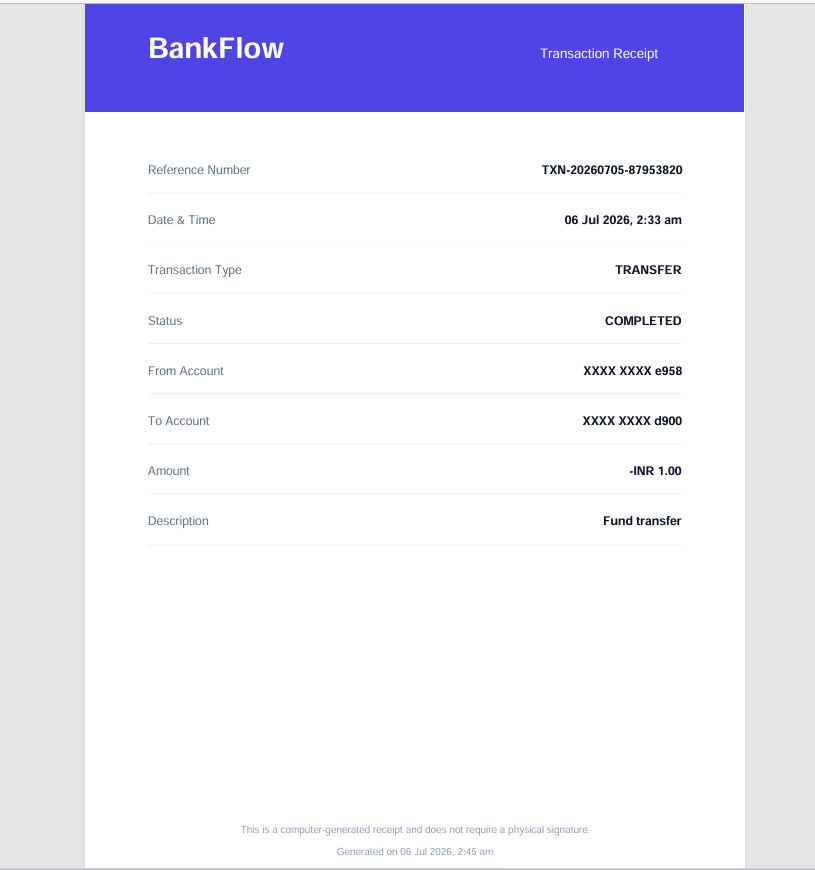

# BankFlow

**Banking that moves at your speed.**  
*Fintech infrastructure for modern teams — move money globally, gain real-time analytics, and protect your business with enterprise-grade fraud detection.*

---

## 📸 Screenshots

### Landing Page


## Feaures


### Dashboard


### Accounts


### Transfer Flow


### Transactions



### AI Fraud Explanation (RAG)

*Shows the AI-powered fraud explanation panel with natural-language reasoning and follow-up question support.*

### PDF Receipt


---

## 🚀 Live Demo & Video

- **Repository:** [GitHub Repo](https://github.com/sagar200507/Bankflow) *(Live deployment coming soon)*
- **Video Walkthrough:** [Demo Video](#) *(Coming soon)*
- **Developed By:** [Your Name / Portfolio Link](#)

---

## ✨ Features

- **Dashboard:** At-a-glance overview of total balance, recent income, 30-day spending, and quick actions.
- **Account Management:** View multiple accounts (Savings, Checking, Business) with their respective balances and 12-digit account numbers. Includes a working flow to deposit funds.
- **Fund Transfers:** Robust intra-bank transfer system (Internal & External). Send money seamlessly using either a 12-digit account number or a system UUID. Built with strict deadlock-prevention and ACID compliance on the backend.
- **Double-Entry Ledger Architecture:** Ledger-based transaction history ensuring accurate internal transfer tracking with human-readable transaction descriptions and Internal Transfer badges.
- **Transaction History:** Paginated, comprehensive ledger of all historical deposits, withdrawals, and transfers.
- **AI-Powered Fraud Explanation (RAG):** SQL window-function based fraud detection paired with an AI layer to explain flags in natural language. Includes follow-up fraud Q&A, Redis caching for AI explanations, and graceful fallback explanations.
- **Concurrency Safety:** PostgreSQL row-locking (`FOR UPDATE`) for concurrency-safe transfers.
- **PDF Receipt Generation:** Instantly generate and download beautifully formatted, accurate PDF transaction receipts for any past or newly completed transaction (fully client-side using `jspdf`).
- **Authentication & Security:** Secure JWT-based auth flow (Access + Refresh tokens), bcrypt password hashing, and rate limiting.

---

## 🏦 Double-Entry Ledger Architecture

The core of BankFlow's accounting is built on a double-entry ledger system:
- **`transactions` table:** Stores immutable business events (the "what" and "why").
- **`ledger_entries` table:** Stores account-specific debit and credit records (the "money movement").
- **Workflow:** Every fund transfer automatically creates exactly 1 transaction record and 2 ledger entries (one debit from the sender, one credit to the receiver). 

This architecture guarantees accurate reconciliation, correct internal transfer history for users, robust auditability, and seamless extensibility for future financial products.

---

## 🤖 AI Fraud Explanation (RAG)

BankFlow uses a hybrid approach to security:
- **Deterministic Flags:** Fraud detection remains completely deterministic. Advanced SQL window functions decide whether a transaction is suspicious based on velocity, location, and amounts. 
- **AI Explanations (The LLM NEVER decides fraud):** The LLM is strictly used as an analytical explanation layer. It reads the raw fraud signals via Retrieval-Augmented Generation (RAG) and explains them in natural language to the user.
- **Interactive Q&A:** Users can ask follow-up questions to understand the exact nature of the flag.
- **Resilience:** All responses are aggressively cached using Redis, and a graceful fallback explanation is instantly returned if the LLM provider is unavailable or rate-limited.

---

### 🚧 Roadmap (Coming Soon)
- **Bill Pay:** Integrated utility and vendor payments directly from the dashboard.
- **Flexible Business Loans:** Eligibility checks and instant capital deployment based on revenue metrics.
- **Advanced Analytics:** Deeper dive charts and historical spending breakdowns.

---

## 🛠 Tech Stack

**Frontend:**
- **React (v18)** — UI Library
- **Vite** — Build Tool & Dev Server
- **React Router (v6)** — Client-side routing
- **Framer Motion** — Micro-animations and page transitions
- **Recharts** — Data visualization
- **Lucide React** — Iconography
- **jsPDF** — Client-side PDF receipt generation
- **Axios** — API Client
- **React Hot Toast** — Notifications

**Backend:**
- **Node.js & Express** — REST API Framework
- **PostgreSQL (pg)** — Relational Database with Window Functions & Row-level Locking
- **Redis (ioredis)** — Caching & Rate Limiting
- **Google Gemini API** — LLM Provider for Retrieval-Augmented Generation (RAG)
- **JWT (jsonwebtoken)** — Secure Authentication
- **Bcrypt** — Password Hashing
- **Express Validator** — Input sanitization and API validation
- **Helmet & Morgan** — Security headers and request logging
- **Jest & Supertest** — Automated testing suite

---

## 📁 Project Structure

```text
bankflow/
├── client/                     # React Frontend
│   ├── public/                 # Static assets
│   ├── src/
│   │   ├── components/         # Reusable UI elements (Layout, Carousels)
│   │   ├── context/            # Global React Contexts (AuthContext)
│   │   ├── pages/              # Route views (Dashboard, Transfer, etc.)
│   │   ├── services/           # Axios API integrations
│   │   └── utils/              # Formatters, PDF receipt generator
│   ├── package.json
│   └── vite.config.js
│
├── server/                     # Node/Express Backend
│   ├── src/
│   │   ├── config/             # DB and Redis connections
│   │   ├── controllers/        # Route logic (fraudExplanation.controller.js)
│   │   ├── db/migrations/      # SQL migrations (including fraud explanation tables)
│   │   ├── middleware/         # Auth, validation, error handling
│   │   ├── models/             # Data Access Layer (ledgerEntry.model.js)
│   │   ├── routes/             # API endpoints definitions
│   │   ├── services/           # Business logic (fraudExplanation.service.js, llm.service.js)
│   │   └── utils/              # Utilities (prompts.js)
│   ├── tests/                  # Unit, integration, and load tests
│   └── package.json
│
└── docs/                       # Documentation and project screenshots
```

---

## ⚙️ Getting Started

### Prerequisites
- Node.js (v18+)
- PostgreSQL (v14+)
- Redis

### 1. Clone & Install
```bash
# Install frontend dependencies
cd client
npm install

# Install backend dependencies
cd ../server
npm install
```

### 2. Environment Setup
Create a `.env` file in the **`client/`** directory:
```env
VITE_API_BASE_URL=http://localhost:5000/api/v1
VITE_APP_NAME=BankFlow
```

Create a `.env` file in the **`server/`** directory:
```env
DB_HOST=localhost
DB_PORT=5432
DB_NAME=bankflow
DB_USER=bankflow_admin
DB_PASSWORD=your_secure_password
DB_POOL_MIN=2
DB_POOL_MAX=10

REDIS_HOST=localhost
REDIS_PORT=6379
REDIS_PASSWORD=
REDIS_TTL_SECONDS=300

JWT_ACCESS_SECRET=your_jwt_access_secret
JWT_REFRESH_SECRET=your_jwt_refresh_secret
JWT_ACCESS_EXPIRY=15m
JWT_REFRESH_EXPIRY=7d

PORT=5000
NODE_ENV=development
CORS_ORIGIN=http://localhost:5173

BCRYPT_SALT_ROUNDS=12
RATE_LIMIT_WINDOW_MS=900000
RATE_LIMIT_MAX_REQUESTS=100

# LLM Integrations
GEMINI_API_KEY=your_gemini_api_key
```

### 3. Database Setup
Ensure PostgreSQL is running and you have created a database matching your `.env` configuration.
```bash
cd server
npm run db:migrate   # Run database migrations
npm run db:seed      # Seed database with initial mock data
npm run db:procedures # Apply advanced DB procedures
```

### 4. Run the App
**Start the Backend Server (Runs on port 5000):**
```bash
cd server
npm run dev
```

**Start the Frontend Client (Runs on port 5173):**
```bash
cd client
npm run dev
```

Open `http://localhost:5173` in your browser.

---

## ⭐ Engineering Highlights

- **Designed and implemented a double-entry ledger architecture.**
- **Built ACID-compliant money transfers using PostgreSQL transactions.**
- **Used row-level locking (`FOR UPDATE`) to prevent race conditions.**
- **Implemented SQL window-function based fraud detection.**
- **Added Retrieval-Augmented Generation (RAG) to explain fraud decisions.**
- **Integrated Redis caching and rate limiting.**
- **Built a responsive React frontend with Framer Motion.**
